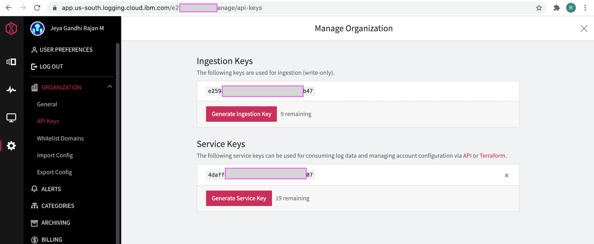

# Log Anomaly Detection by AI-Manager in Watson AI-Ops

This article showcase the **Log Anomaly detection capability of AI-Manager in Watson AI-Ops using LogDNA and BookInfo app**.

The article is based on the the following

- RedHat OpenShift 4.5 on IBM Cloud (ROKS)
- Watson AI-Ops 2.1

## Overview

Here is the architecture and flow of  Watson AI-Ops.


Note: Humio is used in the architecture. But you can use LogDNA as well.

Here is the overall steps to be done for Log Anomaly detection. As part of this article, we will do the checked steps. 

- [ ] 1. Integrate Slack at AI-Manager Instance level
- [ ] 2. Create Application Group
- [ ] 3. Integrate ASM at App Group level
- [ ] 4. Create Application (bookinfo)
- [ ] 5. Train Log Anomaly Models (LogDNA)
- [ ] 6. Integrate LogDNA at app level
- [x] 7. Introduce Log Anomaly at BookInfo app
- [x] 8. View new Incident in a slack story


Here is the picture about it.


## 1. Install BookInfo app in Kubernetes or Openshift

Need to Install BookInfo app.


1. Download Book info manifests files using the link https://istio.io/latest/docs/examples/bookinfo/

2. Create a Namespace called `bookinfo`

  ```
  kubectl create ns bookinfo
  ```

3. We can use simple bookinfo app found in the yaml not the istio version.

  ```
  samples/bookinfo/platform/kube/bookinfo.yaml
  ```

4. Edit the `productpage` Service found in the `bookinfo.yaml` to expose as NodePort. 

  The yaml could look like this.

  ```
  apiVersion: v1
  kind: Service
  metadata:
    name: productpage
    namespace: bookinfo
    labels:
      app: productpage
      service: productpage
  spec:
    type: NodePort
    ports:
    - name: http
      nodePort: 31002
      port: 9080
      protocol: TCP
      targetPort: 9080
    selector:
      app: productpage
  ```

5. Run the yaml to install the book info app.

  ```
  kubectl apply -f samples/bookinfo/platform/kube/bookinfo.yaml
  ```

6. Get the EXTERNAL-IP to access the application

  ```
  $ kubectl get nodes -o wide

  NAME          STATUS     ROLES           AGE    VERSION           INTERNAL-IP   EXTERNAL-IP    OS-IMAGE   KERNEL-VERSION                CONTAINER-RUNTIME
  10.73.12.79   Ready      master,worker   128d   v1.17.1+c5fd4e8   10.73.12.79   1.2.3.4   Red Hat    3.10.0-1127.19.1.el7.x86_64   cri-o://1.17.5-7.rhaos4.4.git6b97f81.el7
  10.73.12.80   NotReady   master,worker   128d   v1.17.1+c5fd4e8   10.73.12.80   1.2.3.5   Red Hat    3.10.0-1127.19.1.el7.x86_64   cri-o://1.17.5-7.rhaos4.4.git6b97f81.el7
  10.73.12.81   Ready      master,worker   128d   v1.17.1+c5fd4e8   10.73.12.81   1.2.3.6   Red Hat    3.10.0-1127.19.1.el7.x86_64   cri-o://1.17.5-7.rhaos4.4.git6b97f81.el7
  10.73.12.90   Ready      master,worker   128d   v1.17.1+40d7dbd   10.73.12.90   1.2.3.7   Red Hat    3.10.0-1160.6.1.el7.x86_64    cri-o://1.17.5-11.rhaos4.4.git7f979af.el7
  ```

7. Access the application using the below url.

```
http://1.2.3.4:31002/productpage
```

1.2.3.4 is EXTERNAL-IP

31002 is the nodeport value (given in the `productpage` Service)

The `productpage` looks like this.


## 2. Create Topology for BookInfo App

Need to create topology for the bookinfo app in the topology manager (ASM). This an optional step.

Refer this article :
https://github.com/GandhiCloudLab/ibm-ai-ops-blog/tree/master/400-topology-observer-job-config

## 3. LogDNA Configuration

We are going to train and inference logs from LogDNA. 

You need to do the following configurations.

- Create LogDNA Instance
- Install LogDNA Agent

## 1. Create LogDNA Instance 

To persist logs, we are going to use LogDNA here.

Create LogDNA Instance on IBM cloud and note down the Keys. You can find the LogDNA information here.  https://cloud.ibm.com/docs/Log-Analysis-with-LogDNA?topic=Log-Analysis-with-LogDNA-getting-started

Here is sample LogDNA service instances created in IBM Cloud.


#### LogDNA Keys 

The logDNA keys are available here. It will be useful for agents and AI-Manager to connect.




## 2. Install LogDNA Agent

To collect logs from the application that installed on a Cluster, we need to have LogDNA agent installed in the cluster, where the application is installed. We can apply appropriate filter to send only the application logs to LogDNA.

### Connecting a LogDNA agent to an OpenShift cluster

The IBM Cloud documentation is available here. https://cloud.ibm.com/docs/Log-Analysis-with-LogDNA?topic=Log-Analysis-with-LogDNA-config_agent_os_cluster

You need to add exclusion rule to the agent to send only the application (bookinfo) specific logs to the logDNA. So given the install instructions here. 

1. Create a `project`. A project is a namespace in a cluster.

```
oc adm new-project --node-selector='' ibm-observe
```

2. Create the `service account` logdna-agent

```
oc create serviceaccount logdna-agent -n ibm-observe
```

3. Grant the serviceaccount access to the Privileged SCC so the service account has permissions to create priviledged LogDNA pods

```
oc adm policy add-scc-to-user privileged system:serviceaccount:ibm-observe:logdna-agent
```

4. Create a secret to set the ingestion key that the LogDNA agent uses to send logs

```
oc create secret generic logdna-agent-key --from-literal=logdna-agent-key= << LOG_DNA_INGESTION_KEY >> -n ibm-observe
```

5. Download LogDNA Agent yaml manifest

Based on the region where LogDNA is installed, you need to use the appropriate link below. 

Refer the IBM Cloud Documentation https://cloud.ibm.com/docs/Log-Analysis-with-LogDNA?topic=Log-Analysis-with-LogDNA-config_agent_os_cluster#config_agent_os_cluster_step4

We have used link for Dallas (us-south).

```
wget https://assets.us-south.logging.cloud.ibm.com/clients/logdna-agent-ds-os.yaml
```

6. Excluding other logs

We can prevent sending the other logs from the cluster to LogDNA by adding a evironment varilable `LOGDNA_EXCLUDE`.

So add the below line under `env:` in the `DaemonSet` found in the above downloaded yaml. This would stop almost all the other logs to reach LogDNA.

```
- name: LOGDNA_EXCLUDE
  value: "/var/log/cron,/var/log/containers/tigera*,/var/log/containers/prometh*,/var/log/containers/grafa*,/var/log/containers/kiali*,/var/log/containers/jaeger*,/var/log/containers/istio*,/var/log/audit/*,/var/log/crio*,/var/log/messag*,/var/log/containers/*eventstreams*,/var/log/containers/*ibm*,/var/log/containers/*asset*,/var/log/containers/*calico*,/var/log/containers/*ibm*,/var/log/containers/*kube-system*,/var/log/containers/*openshift*,/var/lib/*"
```

You can also include other apps/projects/namespaces in the above line as per your need. For example, if you want to stop an banking related application logs you can add like `/var/log/containers/*banking*`


6. Deploy the yaml

Deploy the agent by running the below command.

```
oc apply -f logdna-agent-ds-os.yaml
```

7. You can see the logs in the LogDNA


### Connecting LogDNA agent to Kubernetes cluster

If you want to connect to Kubernetes cluster, you can follow the IBM Cloud documentation https://cloud.ibm.com/docs/Log-Analysis-with-LogDNA?topic=Log-Analysis-with-LogDNA-config_agent_kube_cluster

To prevent the other logs from the cluster to send to LogDNA by adding a evironment varilable `LOGDNA_EXCLUSION_RULES`.

So add the below line under `env:` in the `DaemonSet` found in the above downloaded yaml. This would stop almost all the other logs to reach LogDNA.

```
    - name: LOGDNA_EXCLUSION_RULES
        value: "/var/log/!(containers)*,/var/log/containers/productpage-*,/var/log/containers/reviews*,/var/log/containers/details*,/var/log/containers/kubernetes-*,/var/log/containers/olm-*,/var/log/containerd*,/var/log/syslog,/var/log/containers/weave*,/var/log/containers/*calico*,/var/log/containers/logdna*,/var/log/containers/dashboard*,/var/log/containers/metrics*,/var/log/containers/ibm*"
```

## 4. Generate Load on app

We need to generate logs to download and train normal logs in AI-Manager.

The below simple command calls the 20000 times the application with 10 conncurrent requests.

```
ab -n 20000 -c 10 http://1.2.3.4:31002/productpage?u=normal
```

This is using the apache bench to create the load. https://httpd.apache.org/docs/2.4/programs/ab.html

You might have received enough logs in the LogDNA for training now.


## 5. Download Logs from LogDNA

The load is created, logs are pushed to LogDNA. You need to download the logs from LogDNA.

### Download from LogDNA UI

You can download logs from the UI. It can export the lines currently filtered and it will sent a link to mail for download. But there is a restriction in size. 

It is better to use scripts to download the logs.


### Download from LogDNA using Script

You can download logs from logdna through scripts.

It is better to use scripts to download the logs. Here is the script to download logs between a time range.

```
curl "https://api.us-south.logging.cloud.ibm.com/v1/export?from=1613239459000&to=1613246659000&size=30000" -u << LOG_DNA_SERVICE_KEY >> > log.txt
```

LOG_DNA_SERVICE_KEY : LogDNA Service Key

1613239459000 : From time InMilliseconds

1613239459000 : To time InMilliseconds

30000 : No. of lines to be downloaded


## 6. Configuring AI-Manager

You need to create the following in AI-Manager instance.

- Application Group
- Application called bookinfo
- Slack Integration at AI-Manager instance level
- LogDNA integration at Application level
- ASM Topology Integration at AI-Manager instance level  (Optional)
- NOI-Events (Kafka) Integration at Application level (Optional)

Refer this article : 

https://community.ibm.com/community/user/middleware/blogs/jeya-gandhi-rajan-m1/2021/02/09/configuring-ai-manager-in-watson-ai-ops

## 7. Training Normal Logs

Normal logs downloaded from logDNA to be trained in AI-Manager.

Refer this article : 

https://community.ibm.com/community/user/middleware/blogs/jeya-gandhi-rajan-m1/2021/02/10/training-log-anomaly-models-for-ai-manager


## 8. Log Anomaly detection

You need to Induce an error in the application to create some error in the log. By doing that the error in log would be send to LogDNA. 

The AI-Manager would process the error from the log and create the appropriate slack story.

### Down the Ratings Service

The `Ratings` service in the bookinfo app is called from `ProductPage` service via `Reviews` service

```
ProductPage ---> Reviews ---> Ratings
```

Make the `Ratings` service unavailable by setting the `replica` as 0, by using the below command.

```
kubectl scale --replicas=0 deployment/ratings-v1 -n bookinfo
```

### Run the application

Run the application couple of times by opening the below url in the browser.

```
http://1.2.3.4:31002/productpage
```

The error might have occurred in logs and logs might pushed to LogDNA.

### Slack Story

The error logs received in LogDNA would be processed by AI-Manager and creates slack story.


The SRE would look into this story to understand more about the incident and work on this to solve the issue.


## Conclusion

By using trained logs Model, AI-Manager is able to find log anomalies and alert SRE by creating incident as a slack story.

## Note

Instead of using LogDNA here, we can use Humio as well.

## Appendix

#### Training Log anomaly models for AI Manager in Watson AI-Ops

https://community.ibm.com/community/user/middleware/blogs/jeya-gandhi-rajan-m1/2021/02/10/training-log-anomaly-models-for-ai-manager

#### Configuring AI-Manager in Watson AI-Ops

https://community.ibm.com/community/user/middleware/blogs/jeya-gandhi-rajan-m1/2021/02/09/configuring-ai-manager-in-watson-ai-ops


